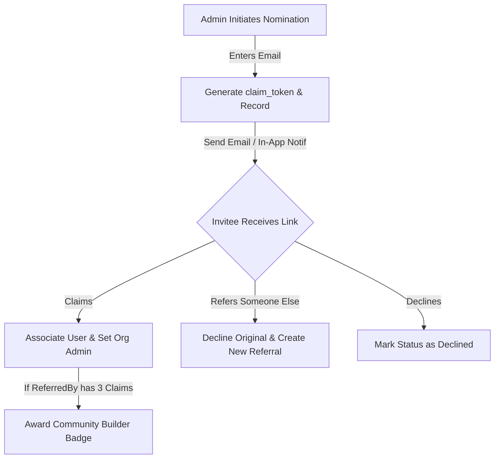

# Organization Administrator Nomination Process

This document details the process for nominating, claiming, referring, or declining administrator ownership for an Organization. It acts as a reference for implementing this system within the Expo React Native app.

---

## Invitation Email Template & Copy Strategy

To maximize the conversion rate (ensuring organizations are claimed quickly or successfully delegated), the invitation email focuses on value, ease of use, and clarity.

### Email Structure

* **Sender:** `"ScoreKeeper" <noreply@scorekeeper.com>`
* **Subject Option 1 (Recommended):** `Invitation to manage {orgName} on ScoreKeeper`
* **Subject Option 2:** `Take control of {orgName} on ScoreKeeper (30s to claim)`
* **Message Body (High-Conversion HTML Design):**
  * **Header Banner:** Sleek brand logo with the tagline: *"Real-time scorekeeping, schedules, and team management made simple."*
  * **Value Proposition & Hook:** 
    > *"Hi there, You've been nominated to claim administrative access for **{orgName}** on ScoreKeeper. The organization has already been pre-configured for you, meaning you can get started in under 30 seconds."*
  * **Key Benefits Checklist (Selling the "Why"):**
    * **Zero Setup Required:** Your organization is already created. Just claim it to start managing your teams immediately.
    * **Engage Your Community:** Publish real-time game updates, live scores, and schedules for players and fans.
    * **Delegated Control:** Invite coaches, managers, and scorekeepers, assigning specific roles to share the workload.
    * **Always Free to Start:** No credit cards, no contracts.
  * **Primary CTA:** A large, high-contrast orange button: **"Claim Your Organization"** (Links to `{APP_URL}/claim?token={token}`).
  * **Alternative Options (Secondary Actions):**
    * **Refer a Colleague:** *"Not the right person? Please help us by passing it on to the right contact."* -> **"Refer Someone Else"** button (Links to `{APP_URL}/claim/refer?token={token}`).
    * **Decline:** A subtle link: *"Decline this invitation."* (Links to `{APP_URL}/claim/decline?token={token}`).

---

## Forwarding vs. Referral Delegation

### 1. Direct Email Forwarding (Supported)
* **How it works:** The recipient can simply forward the invitation email to a colleague.
* **Why it works:** The claim link contains a secure, single-use token (`/claim?token={token}`) that authorizes the claim. The backend does not enforce that the claiming account's email matches the invitee's original email address.
* **Impact:** Forwarding **will not break the process**. When the colleague clicks the link and signs in, they will successfully claim the organization under their own credentials.
* **Email helper note:** We include a small text block in the email footer: *"You can also forward this email directly to the correct contact if you prefer."*

### 2. Formal Referral (Preferred for Tracking)
* **How it works:** The recipient clicks "Refer Someone Else" and enters their colleague's email address.
* **Why it is preferred:** 
  * It updates the original referral status to `referred` (keeping the database history clean).
  * It generates a new invitation email addressed directly to the colleague.
* **Referral Privacy Guarantee:** To build trust, the referral screen must prominently state: 
  > **Privacy Policy:** *"We will only use this email address to send a one-time invitation to claim this organization. We will never sell their data or send them marketing spam."*

---

## 1. Process Overview

The nomination flow is designed to securely transition or delegate the administrative ownership of an organization (e.g., when a league manager creates placeholder organizations and needs to invite the actual team managers to take control).



---

## 2. Database Schema

The process relies on the `org_claim_referrals` table:

```sql
CREATE TABLE org_claim_referrals (
    id VARCHAR(50) PRIMARY KEY,
    org_id VARCHAR(50) NOT NULL REFERENCES organizations(id),
    referred_email VARCHAR(255) NOT NULL,
    referred_by_user_id VARCHAR(50) REFERENCES users(id),
    claim_token VARCHAR(64) UNIQUE NOT NULL,
    status VARCHAR(20) DEFAULT 'pending', -- 'pending', 'claimed', 'declined', 'referred'
    claimed_by_user_id VARCHAR(50) REFERENCES users(id),
    created_at TIMESTAMP DEFAULT CURRENT_TIMESTAMP,
    claimed_at TIMESTAMP,
    
    CONSTRAINT unique_org_email_referral UNIQUE (org_id, referred_email)
);
```

### Referral Status Lifecycle
* **`pending`**: Invitation sent, awaiting action from the invitee.
* **`claimed`**: Invitee logged in and successfully took ownership of the organization.
* **`declined`**: Invitee rejected the invitation.
* **`referred`**: Invitee selected "Refer Someone Else" and provided a different email. A new referral record was spawned.
* **`voided`**: Another nominee claimed the organization first, making this nomination inactive.

### Expiration, Conflict Resolution & Cooldown Policy
* **No Token Expiration**: Invitation links/tokens do not expire over time. A nominee can use their link to claim the organization at any time, provided the organization remains unclaimed.
* **Single Active Claim Rule (Conflict Resolution)**: Once an organization is successfully claimed by *any* nominee, all other remaining `pending` nominations for that organization must automatically have their status updated to `voided`.
* **Invitation Cooldown (`invite_cooldown_hours`)**: 
  * This setting (configured in the `system_settings` table, currently `336` hours / 2 weeks) prevents sending duplicate invitations to the same person in short succession.
  * If a user tries to nominate an email that already has a `pending` nomination for the same organization (**implemented 2026-09-05** in `ReferralManager.createReferrals`; before this, an existing address was skipped outright and never resent):
    * **Either way**: the caller is recorded in `org_claim_referral_nominators`, so their own screens show the org as referred by them (see `org_claim_status` below).
    * **Within Cooldown**: no new email is sent. The result row carries `emailSent: false`.
    * **Outside Cooldown** (measured from `last_sent_at`, falling back to `created_at`): a new token is generated, `referred_by_user_id` moves to the new nominator (so they get credit), `last_sent_at` is set to `NOW()` and a new invitation email is sent. `created_at` is never rewritten.
  * An address whose nominee has already `claimed`, `declined` or passed the invitation on (`referred`) is left alone and comes back with `emailSent: false`.
  * The result of `REFER_ORG_CONTACT` never includes `claim_token`: it is the credential the email carries, and a caller re-nominating someone else's address must not receive it.

---

## 3. Server-Side Implementation (`ReferralManager`)

The backend exposes several methods to manage nominations:

1. **`createReferrals(orgId, contactEmails, referredByUserId)`**
   * Normalizes emails to lowercase.
   * Checks for existing referrals for the same organization and email to prevent duplication.
   * Generates a 32-byte hex token.
   * Inserts the record and dispatches an invitation email using `mailManager.sendClaimInvitation`.
   * Creates an in-app notification of type `claim_invitation` if the email matches an existing user.

2. **`getClaimInfo(token)`**
   * Retrieves the organization's name, logo, and the status of the referral using the token.

3. **`claimOrgViaToken(token, userId)`**
   * Validates the token is `pending` (and not expired by time).
   * Updates referral status to `claimed` and records the claimant's user ID.
   * Updates the organization record: sets `is_claimed = true` (**Note**: The original `creator_id` of the organization must NOT be modified. It remains assigned to the person who originally created the organization).
   * Voids other nominations: Updates all other `pending` nominations for the same `org_id` to `expired`.
   * Elevates the claimant to administrator:
     * Creates/ensures an organization profile for the user in the org.
     * Inserts an entry in `org_memberships` with `role_id = 'role-org-admin'`.
   * Tracks metrics: Awards the `'community_builder'` badge on the first successfully claimed referral, and the `'community_champion'` badge when the referrer (`referred_by_user_id`) reaches $\ge 5$ successfully claimed referrals.

4. **`referOrgContactViaToken(token, contactEmails)`**
   * Finds the original referral and marks it as `referred`.
   * Creates a new referral record using the new email address(es), keeping the original referrer's ID to preserve badge/credit lineage.

5. **`declineClaim(token)`**
   * Sets the referral status to `declined`.

---

## 4. Front-End User Experience & Flow

### Phase A: Nominating (Initiator Side)
To ensure the nomination flow is consistent and easy to access, a single **Reusable Nomination Form/Modal** should be created. This component handles inputting one or more contact emails for a specific `orgId`.

#### Key Entry Points:
1. **Organization Admin Dashboard:**
   * **Where:** Admin Settings screen for a claimed/unmanaged organization.
   * **Behavior:** Shows a management dashboard including the active nomination history and a form to invite additional administrators.
2. **Match or Event Setup Flows (Creation & Editing):**
   * **Where:** When creating/editing a match, game, or event, users can select an existing organization (which may be unmanaged/unclaimed) or create a new one as a placeholder.
   * **Behavior & Phrasing:**
     * **If an unmanaged organization is selected:** Present a prompt with a helpful, community-driven tone:
       > **Title:** *"Help us get this organization claimed!"*
       > **Prompt:** *"If you know who manages **{orgName}** (e.g. school head of sports, club secretary), add their email below. We'll send them an invitation to claim administrative access so they can manage their own teams, rosters, and schedules."*
     * **If a new organization is created as a placeholder:** Show the organization registration completion along with the same referral/nomination block inline:
       > **Title:** *"Known Contacts?"*
       > **Prompt:** *"Help us get this organization claimed! If you know who manages **{orgName}**, add their email below. We'll send them an invite to claim it."*

---

#### Nominating from an organisation chip (`UnclaimedOrgBadge`)

Wherever a screen lets a user add organisations they do not belong to — the tournament create
screen's participating-organisation chips are the first — the appeal to nominate an administrator
lives behind a small icon on the chip, not inline on the form. Rationale and behaviour (decided
2026-09-05):

* **Not inline.** A card per unclaimed organisation dominated the tournament form and distracted
  from its purpose. The chip shows a **yellow** alert icon for an unclaimed org the caller has not
  yet referred anyone for, and a **green** mail icon once they have. Hovering explains either
  state; clicking opens a modal with the appeal and an email field.
* **Prompted on add, not only on click.** With `autoPrompt` (the create screen sets it), a chip
  the user has just added opens the modal itself as soon as its status comes back yellow, so the
  appeal does not depend on them wondering what the icon means. Once per org; they can cancel. A
  chip that comes back green is simply shown green. Screens that render chips which were already
  there when they opened should leave `autoPrompt` off.
* **An address that has already answered is said so.** If the nominee has `declined`, the modal
  says so by name and offers "Nominate a different contact", which returns to the empty field; the
  org stays yellow. The same for an address that passed the invitation on (`referred`). An address
  that has `claimed` the org is reported as needing no invitation.
* **Sent immediately.** Submitting the email emits `REFER_ORG_CONTACT` there and then. The
  nomination is not part of whatever process the org is being added to, so it must not wait for
  that form to save (or be lost when it is cancelled). The match form's older inline prompt still
  batches its emails until save — see the TODO entry `ORG-6`.
* **Asked once per person.** The badge reads `get_data { type: "org_claim_status", orgId }` on
  mount (classified `authenticated` in `dataAccess.ts`) and returns `OrgClaimStatus`: whether the
  org is claimed and the caller's **own** pending nominations. Another user's nomination is not
  reported at all — the org stays yellow for this caller until they name a contact themselves. If
  they name the address someone else already used, they become a nominator of it (green for them)
  and the cooldown above decides whether the email goes again. Nominations do not expire, so a
  pending one is current, and an organiser setting up several events in one day sees green rather
  than being asked about the same school each time. They may still invite a further contact.

### Phase B: Receiving & Processing (Invitee Side)
1. **Landing/Claim Screen (`/claim?token=<token>`)**
   * Validates token on load. Shows error if invalid or expired.
   * Shows organization identity (logo and name).
   * **Authentication check**:
     * If user is **not authenticated**, prompts them to log in or register. The token is preserved (e.g., in persistent storage or URL callbacks) so they return directly here after authentication.
     * If **authenticated**, shows a button to "Claim Org Now".
2. **Transferring Nomination (Refer Screen)**
   * Provides option to delegate to a colleague.
   * Prompt: "Know the right person to manage [Org Name]? Enter their email address..."
   * Invokes referral transfer endpoint and redirects to safety (Home Screen).
3. **Declining Nomination**
   * Declines invitation and redirects to safety.

---

## 5. Next Steps for Expo Implementation

To integrate this workflow into the Expo App, the following elements need to be built:

1. **API Endpoints ([api.ts](file:///c:/Fred/Coding/SK/expo-app/services/api.ts))**:
   * Add methods mapping to backend referral services:
     ```typescript
     getClaimInfo(token: string): Promise<ClaimInfo>;
     claimOrg(token: string): Promise<Organization>;
     referOrgContact(token: string, emails: string[]): Promise<void>;
     declineClaim(token: string): Promise<void>;
     getOrgNominations(orgId: string): Promise<Referral[]>;
     nominateContacts(orgId: string, emails: string[]): Promise<void>;
     ```
2. **Deep Linking Configuration**:
   * Map `/claim?token=...` to a deep link or web fallback page that routes the user directly to the claim screen within the application.
3. **Claim Navigation & Authentication Interceptor**:
   * Build the `ClaimScreen` that checks `authStore`. If unauthorized, cache the token, navigate to `LoginScreen`, and ensure the login redirect routes back to `ClaimScreen` with the token.
4. **Nomination Settings Panel**:
   * Add the nomination management component to the admin settings screen inside `app/admin/[orgId]/settings` conforming to standard card and action layouts.
