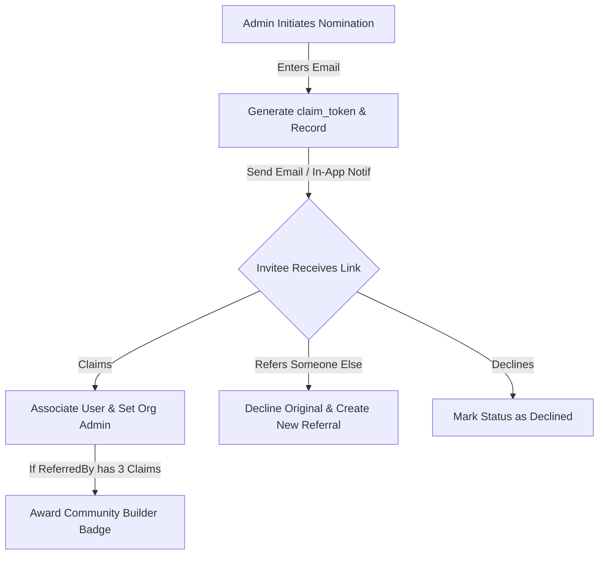

# Organization Administrator Nomination Process

This document details the process for nominating, claiming, referring, or declining administrator ownership for an Organization. It acts as a reference for implementing this system within the Expo React Native app.

---

## Invitation Email Template & Copy Strategy

To maximize the conversion rate (ensuring organizations are claimed quickly or successfully delegated), the invitation email focuses on value, ease of use, and clarity.

### Email Structure

* **Sender:** `"ScoreKeeper" <noreply@scorekeeper.com>`
* **Subject Option 1 (Recommended):** `Invitation to manage {orgName} on ScoreKeeper`
* **Subject Option 2:** `Take control of {orgName} on ScoreKeeper (30s to claim)`
* **Message Body (High-Conversion HTML Design):**
  * **Header Banner:** Sleek brand logo with the tagline: *"Real-time scorekeeping, schedules, and team management made simple."*
  * **Value Proposition & Hook:** 
    > *"Hi there, You've been nominated to claim administrative access for **{orgName}** on ScoreKeeper. The organization has already been pre-configured for you, meaning you can get started in under 30 seconds."*
  * **Key Benefits Checklist (Selling the "Why"):**
    * **Zero Setup Required:** Your organization is already created. Just claim it to start managing your teams immediately.
    * **Engage Your Community:** Publish real-time game updates, live scores, and schedules for players and fans.
    * **Delegated Control:** Invite coaches, managers, and scorekeepers, assigning specific roles to share the workload.
    * **Always Free to Start:** No credit cards, no contracts.
  * **Primary CTA:** A large, high-contrast orange button: **"Claim Your Organization"** (Links to `{APP_URL}/claim?token={token}`).
  * **Alternative Options (Secondary Actions):**
    * **Refer a Colleague:** *"Not the right person? Please help us by passing it on to the right contact."* -> **"Refer Someone Else"** button (Links to `{APP_URL}/claim/refer?token={token}`).
    * **Decline:** A subtle link: *"Decline this invitation."* (Links to `{APP_URL}/claim/decline?token={token}`).

---

## Forwarding vs. Referral Delegation

### 1. Direct Email Forwarding (Supported)
* **How it works:** The recipient can simply forward the invitation email to a colleague.
* **Why it works:** The claim link contains a secure, single-use token (`/claim?token={token}`) that authorizes the claim. The backend does not enforce that the claiming account's email matches the invitee's original email address.
* **Impact:** Forwarding **will not break the process**. When the colleague clicks the link and signs in, they will successfully claim the organization under their own credentials.
* **Email helper note:** We include a small text block in the email footer: *"You can also forward this email directly to the correct contact if you prefer."*

### 2. Formal Referral (Preferred for Tracking)
* **How it works:** The recipient clicks "Refer Someone Else" and enters their colleague's email address.
* **Why it is preferred:** 
  * It updates the original referral status to `referred` (keeping the database history clean).
  * It generates a new invitation email addressed directly to the colleague.
* **Referral Privacy Guarantee:** To build trust, the referral screen must prominently state: 
  > **Privacy Policy:** *"We will only use this email address to send a one-time invitation to claim this organization. We will never sell their data or send them marketing spam."*

---

## 1. Process Overview

The nomination flow is designed to securely transition or delegate the administrative ownership of an organization (e.g., when a league manager creates placeholder organizations and needs to invite the actual team managers to take control).


```mermaid
graph TD
    A[Admin Initiates Nomination] -->|Enters Email| B[Generate claim_token & Record]
    B -->|Send Email / In-App Notif| C{Invitee Receives Link}
    C -->|Claims| D[Associate User & Set Org Admin]
    C -->|Refers Someone Else| E[Decline Original & Create New Referral]
    C -->|Declines| F[Mark Status as Declined]
    D -->|If ReferredBy has 3 Claims| G[Award Community Builder Badge]
```

---

## 2. Database Schema

The process relies on the `org_claim_referrals` table:

```sql
CREATE TABLE org_claim_referrals (
    id VARCHAR(50) PRIMARY KEY,
    org_id VARCHAR(50) NOT NULL REFERENCES organizations(id),
    referred_email VARCHAR(255) NOT NULL,
    referred_by_user_id VARCHAR(50) REFERENCES users(id),
    claim_token VARCHAR(64) UNIQUE NOT NULL,
    status VARCHAR(20) DEFAULT 'pending', -- 'pending', 'claimed', 'declined', 'referred'
    claimed_by_user_id VARCHAR(50) REFERENCES users(id),
    created_at TIMESTAMP DEFAULT CURRENT_TIMESTAMP,
    claimed_at TIMESTAMP,
    
    CONSTRAINT unique_org_email_referral UNIQUE (org_id, referred_email)
);
```

### Referral Status Lifecycle
* **`pending`**: Invitation sent, awaiting action from the invitee.
* **`claimed`**: Invitee logged in and successfully took ownership of the organization.
* **`declined`**: Invitee rejected the invitation.
* **`referred`**: Invitee selected "Refer Someone Else" and provided a different email. A new referral record was spawned.
* **`voided`**: The organisation got an administrator while this nomination was pending — another
  nominee claimed it, a member took the empty role, or an admin was added some other way — so it can
  no longer be claimed. Distinct from `expired` (a time limit ran out; nominations have none today).
  Following a voided link shows *"{Org} has already been claimed"* and names its current
  administrators to contact.

### Expiration, Conflict Resolution & Cooldown Policy
* **No Token Expiration**: Invitation links/tokens do not expire over time. A nominee can use their link to claim the organization at any time, provided the organization remains unclaimed.
* **Single Active Claim Rule (Conflict Resolution)**: Once an organisation has an administrator, however it got one, every remaining `pending` nomination for it is `voided` (implemented 2026-09-27, `ORG-10`): by `claimOrgViaToken` in the claim's own transaction, and by `OrganizationManager.syncClaimedStatus`, which every other way of adding or promoting an admin runs. The org row is locked during a claim, so two nominees claiming at once cannot both become admin.
* **Nominating is only for an organisation with no administrator.** `createReferrals` refuses one that has an active admin. Its admins make someone else an admin by adding them as a member with the admin role and inviting them — a different process (decided 2026-09-27).
* **Invitation Cooldown (`invite_cooldown_hours`)**: 
  * This setting (configured in the `system_settings` table, currently `336` hours / 2 weeks) prevents sending duplicate invitations to the same person in short succession.
  * If a user tries to nominate an email that already has a `pending` nomination for the same organization (**implemented 2026-09-05** in `ReferralManager.createReferrals`; before this, an existing address was skipped outright and never resent):
    * **Either way**: the caller is recorded in `org_claim_referral_nominators`, so their own screens show the org as referred by them (see `org_claim_status` below).
    * **Within Cooldown**: no new email is sent. The result row carries `emailSent: false`.
    * **Outside Cooldown** (measured from `last_sent_at`, falling back to `created_at`): a new token is generated, `referred_by_user_id` moves to the new nominator (so they get credit), `last_sent_at` is set to `NOW()` and a new invitation email is sent. `created_at` is never rewritten.
  * An address whose nominee has already `claimed`, `declined` or passed the invitation on (`referred`) is left alone and comes back with `emailSent: false`.
  * **A deliberate resend** (`resend: true`, 2026-09-27, `ORG-7`) sends again inside the cooldown with a new token and restarts it, without moving the credit; see §4.
  * The result of `REFER_ORG_CONTACT` never includes `claim_token`: it is the credential the email carries, and a caller re-nominating someone else's address must not receive it.

---

## 3. Server-Side Implementation (`ReferralManager`)

The backend exposes several methods to manage nominations:

1. **`createReferrals(orgId, contactEmails, referredByUserId, { resend })`**
   * `referredByUserId` is the signed-in caller, set by the handler — never read from the payload (it was until 2026-09-27, which let a caller nominate, and earn the badges, as someone else).
   * Refuses an organisation that already has an active administrator (see §2).
   * Normalizes emails to lowercase.
   * Checks for existing referrals for the same organization and email to prevent duplication.
   * Generates a 32-byte hex token.
   * Inserts the record and dispatches an invitation email using `mailManager.sendClaimInvitation`.
   * Creates an in-app notification of type `claim_invitation` if the email matches an existing user.

2. **`getClaimInfo(token)`**
   * Retrieves the organization's name, logo, and the status of the referral using the token.
   * For a `voided` referral, also `adminNames`: the names of the org's current administrators, for the "already claimed" message. Nothing else about them.

3. **`claimOrgViaToken(token, userId)`**
   * Validates the token is `pending` (and not expired by time).
   * Updates referral status to `claimed` and records the claimant's user ID.
   * Refuses if the organisation already has an active administrator, with the organisation row locked so concurrent claims are serialised.
   * Updates the organization record: sets `is_claimed = true` (**Note**: The original `creator_id` of the organization must NOT be modified. It remains assigned to the person who originally created the organization. The claimant runs the org; they did not create it. The app-admin `CLAIM_ORG` follows the same rule.)
   * Voids other nominations: Updates all other `pending` nominations for the same `org_id` to `voided`.
   * Elevates the claimant to administrator:
     * Creates/ensures an organization profile for the user in the org.
     * Inserts an entry in `org_memberships` with `role_id = 'role-org-admin'`.
   * Tracks metrics: Awards the `'community_builder'` badge on the first successfully claimed referral, and the `'community_champion'` badge when the referrer (`referred_by_user_id`) reaches $\ge 5$ successfully claimed referrals.

4. **`referOrgContactViaToken(token, contactEmails)`**
   * Finds the original referral and marks it as `referred`.
   * Creates a new referral record using the new email address(es), keeping the original referrer's ID to preserve badge/credit lineage.

5. **`declineClaim(token)`**
   * Sets the referral status to `declined`.

---

## 4. Front-End User Experience & Flow

### Phase A: Getting an organisation an administrator (one process, decided 2026-09-27)

An organisation with no administrator is asked about in one way everywhere: **one dialog,
[NominateAdminModal](file:///c:/Fred/Coding/SK/expo-app/components/NominateAdminModal.tsx), opened
from three places**, with the same colours meaning the same thing — amber while *you* have not
nominated anyone for it, green once you have. Its server calls are
[services/nominations.ts](file:///c:/Fred/Coding/SK/expo-app/services/nominations.ts), and what it
knows about the org comes from `useOrgClaimStatus` (`get_data org_claim_status`). This replaced five
separate implementations (`ORG-6`), two of which held the email until a form was saved.

#### The dialog

* **Nominate anyone by email**, sent the moment it is submitted. A nomination is never part of
  whatever form the org was being added to, so cancelling that form cannot lose it.
* **A member of the org can pick a fellow member** from its people, which fills in their address.
* **"It's me: take on the admin role"** is offered only when the server says the caller may
  (`OrgClaimStatus.canTakeOver`, below). It takes the role at once, with no email.
* **Nobody nominates their own address.** The server refuses one of the caller's known addresses
  (`ReferralManager.refuseOwnAddress`): a claim email to yourself proves nothing a signed-in account
  does not, and someone who may not take the role must not get round that by inviting themselves. A
  second address never added to their account cannot be told apart from anyone's (`ORG-9`).
* **Every answer is said by name.** An address that has declined or passed the invitation on is not
  an invitation sent; the dialog says so and offers "Nominate a different contact". An address that
  has claimed needs no invitation. One invited inside the cooldown gets no second email, and the
  caller is recorded as a nominator of it.
* **Only for an org with no administrator.** Settings hides Nominate once the org has one, and keeps
  the list as history; the server refuses a nomination anyway (`ORG-10`). Further admins are added
  as members and invited (until 2026-09-27 settings used this dialog to invite them).

#### Where it opens from

1. **The workspace banner** ([UnclaimedOrgBanner](file:///c:/Fred/Coding/SK/expo-app/components/UnclaimedOrgBanner.tsx)),
   one line across the top of every page of `/admin/[orgId]` while the org is unclaimed: *"{Org}
   has no administrator yet. Please nominate someone to run it."* The same words for members and
   outsiders; whether the viewer may take the role is the dialog's to offer. It cannot be
   dismissed, and goes when the org is claimed — `isClaimed` arrives with the org summary, which is
   broadcast on every membership change that can alter it.
2. **The chip badge** ([UnclaimedOrgBadge](file:///c:/Fred/Coding/SK/expo-app/components/UnclaimedOrgBadge.tsx)),
   an icon on an organisation chip wherever a form picks *someone else's* org: the match form's two
   sides, the add-game screen's opponent, the tournament entrants screen. Not an inline card: one
   per unclaimed org dominated the tournament form (decided 2026-09-05). With `autoPrompt`, a chip
   the user has **just added** opens the dialog by itself once its status comes back amber — once
   per org, and never for chips already there when the screen opened or for the workspace's own org.
3. **Settings › Administrator Nominations**: the org's nomination history, a Nominate button, and
   **Resend** on each pending row (below).

The register-an-org dialog ([RegisterOrgModal](file:///c:/Fred/Coding/SK/expo-app/components/RegisterOrgModal.tsx))
keeps its own contact field, since the org has no chip yet; its callers send it through the same
`nominateOrgContact` straight away.

#### Taking the empty role (`TAKE_ORG_ADMIN`)

An org can end up with no administrator — most likely one left unattended, which someone now wants
to revive. It should rarely happen, and when it does anyone suitable may take the role, with no
email. `ReferralManager.getAdminTakeover` decides, and `takeOrgAdmin` re-checks it:

* **Only while the org has no active admin.**
* **A member of `admin_takeover_min_days` standing** (a system setting, 30 by default), counted from
  their membership's `start_date`. Member and staff are equal here. Someone newer is told the date
  from which they may (`takeOverFrom`) and is not offered "It's me".
* **Or anyone, when no one else with an account is a member** — a never-claimed org, where nobody is
  left to protect. People an outsider added by name to an unclaimed org cannot sign in, so they do
  not count. Nobody can make themselves a member of an unclaimed org without an admin: an outsider
  may create a person there by name only, which matches no account (`profileGate.ts`).
* A membership counts as the caller's by linked account or verified email, as everywhere else. A
  restricted minor's does not qualify, and platform admin accounts never do.
* A member's own membership is promoted in place, keeping its start date; anyone else gets a profile
  and an admin membership. `creator_id` is not touched.

Other members are not told; notifying them, or letting them vote, is in
[FUTURE_IDEAS.md](file:///c:/Fred/Coding/SK/FUTURE_IDEAS.md).

#### Resending a lost invitation (`ORG-7`)

`REFER_ORG_CONTACT` with `resend: true` sends a pending nomination's invitation again **inside** the
cooldown, with a new claim token (the earlier link stops working) and a restarted cooldown. It is
not a nomination, so the credit and nominators stay as they were. It is refused unless the caller
can see the org's nominations (`org:{id}:referrals`: its members, and platform admins), and the only
place that offers it is the settings list — behind a warning, as for member invites: check the spam
folder first, and the old link will stop working.

#### Asked once per person

`get_data { type: "org_claim_status", orgId }` (classified `authenticated` in `dataAccess.ts`)
returns `OrgClaimStatus`: whether the org is claimed, the caller's **own** pending nominations,
whether they are a member, and whether and from when they may take the role. Another user's
nomination is not reported — the org stays amber for this caller until they name a contact
themselves. If they name the address someone else already used, they become a nominator of it
(green for them) and the cooldown decides whether the email goes again. Nominations do not expire,
so a pending one is current, and an organiser setting up several events in one day sees green
rather than being asked about the same school each time.

### Phase B: Receiving & Processing (Invitee Side)
1. **Landing/Claim Screen (`/claim?token=<token>`)**
   * Validates token on load. Shows error if invalid or expired.
   * A `voided` token shows *"{Org} has already been claimed, so this invitation no longer works"*, with the administrators' names to contact.
   * Shows organization identity (logo and name).
   * **Authentication check**:
     * If user is **not authenticated**, prompts them to log in or register. The token is preserved (e.g., in persistent storage or URL callbacks) so they return directly here after authentication.
     * If **authenticated**, shows a button to "Claim Org Now".
2. **Transferring Nomination (Refer Screen)**
   * Provides option to delegate to a colleague.
   * Prompt: "Know the right person to manage [Org Name]? Enter their email address..."
   * Invokes referral transfer endpoint and redirects to safety (Home Screen).
3. **Declining Nomination**
   * Declines invitation and redirects to safety.

---

## 5. Next Steps for Expo Implementation

To integrate this workflow into the Expo App, the following elements need to be built:

1. **API Endpoints ([api.ts](file:///c:/Fred/Coding/SK/expo-app/services/api.ts))**:
   * Add methods mapping to backend referral services:
     ```typescript
     getClaimInfo(token: string): Promise<ClaimInfo>;
     claimOrg(token: string): Promise<Organization>;
     referOrgContact(token: string, emails: string[]): Promise<void>;
     declineClaim(token: string): Promise<void>;
     getOrgNominations(orgId: string): Promise<Referral[]>;
     nominateContacts(orgId: string, emails: string[]): Promise<void>;
     ```
2. **Deep Linking Configuration**:
   * Map `/claim?token=...` to a deep link or web fallback page that routes the user directly to the claim screen within the application.
3. **Claim Navigation & Authentication Interceptor**:
   * Build the `ClaimScreen` that checks `authStore`. If unauthorized, cache the token, navigate to `LoginScreen`, and ensure the login redirect routes back to `ClaimScreen` with the token.
4. **Nomination Settings Panel**:
   * Add the nomination management component to the admin settings screen inside `app/admin/[orgId]/settings` conforming to standard card and action layouts.
